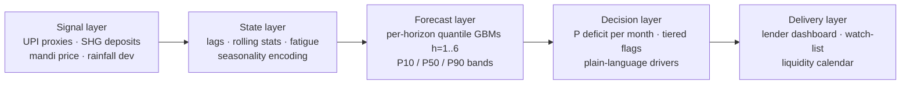

# RISKON

AI-driven cash-flow prediction & risk-flagging for rural micro enterprises.
**NABARD Hackathon @ Global FinTech Fest 2026 — Round 2 prototype.**

Forecasts monthly net cash flow 1–6 months ahead per enterprise as P10/P50/P90
quantile bands, converts the band into **P(deficit)** per future month, and turns
that into a tiered early-warning layer with plain-language drivers and field
actions. Three cohorts: kharif farmer, dairy SHG member, kirana trader.

**Holdout results (6-month, months 37–42):**
MAE **₹3,393** vs ₹5,987 seasonal baseline (**43% better**) · flags **88% precision / 79% recall** · 76% P10–P90 coverage.

## Quickstart

```bash
python ml/pipeline.py        # simulate panel → train quantile GBMs → export JSON (optional: exports are committed)
cd frontend && npm install
npm run dev                  # open http://localhost:5173
```

The pipeline exports static JSON artifacts to `frontend/public/data/`, so the
dashboard needs **no backend or retraining at request time** — exactly how a
production deployment would serve nightly-batch scores to field devices.

## Architecture



## Dashboard views

| View | Purpose |
|------|---------|
| **Overview** | Portfolio KPIs, state stress index, cohort mix, top-risk enterprises |
| **Watch-list** | Tiered flag table (>80% field-visit / 60–80% watch) with drivers & actions |
| **Enterprise detail** | 24-month history + fan chart with flag marker; UPI / rainfall / mandi / SHG sparklines |
| **Liquidity calendar** | Enterprise × month P(deficit) heatmap, cohort filter, click-through |

## Repo layout

```
ml/pipeline.py     panel simulation + quantile forecasting + JSON export (seed-locked to Round 1 deck)
frontend/          React + Vite + Tailwind + Recharts dashboard
docs/              3-minute demo video script
code/, figs/       original Round 1 scripts and figures (kept for provenance)
```

## Honest scope

All data is **calibrated synthetic** (kharif calendar, monsoon input costs,
festival demand, drought regimes — every page carries the disclosure footer).
The pipeline is signal-agnostic: Round 3 swaps the simulated blocks for live
AGMARKNET, IMD and SHG-ledger feeds without touching the model layer.
